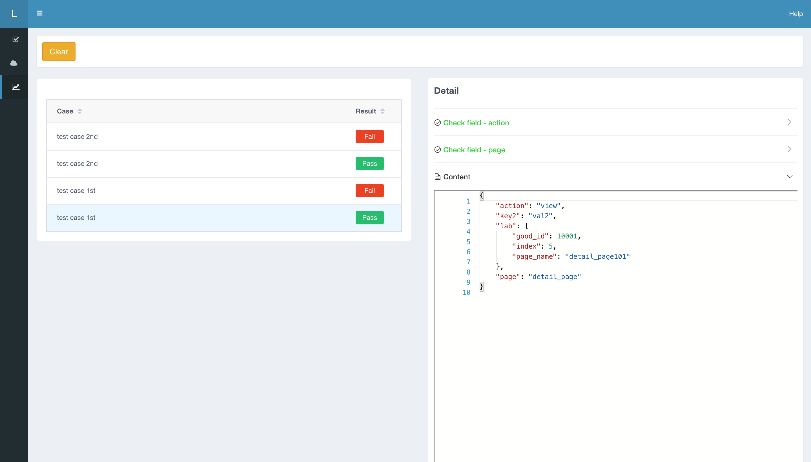
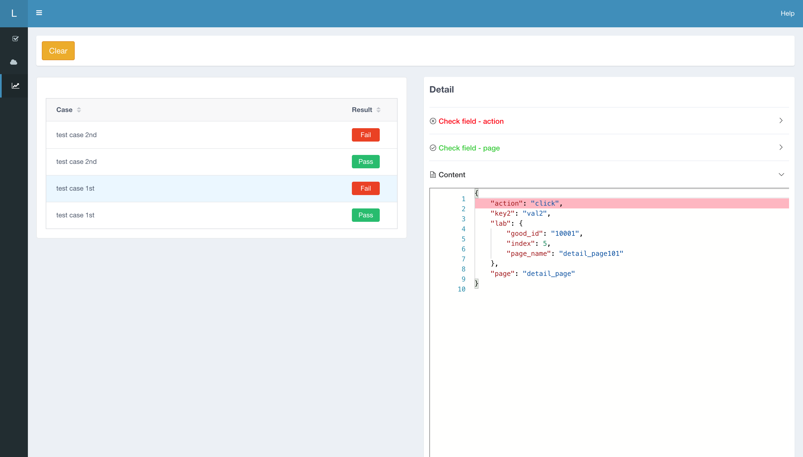
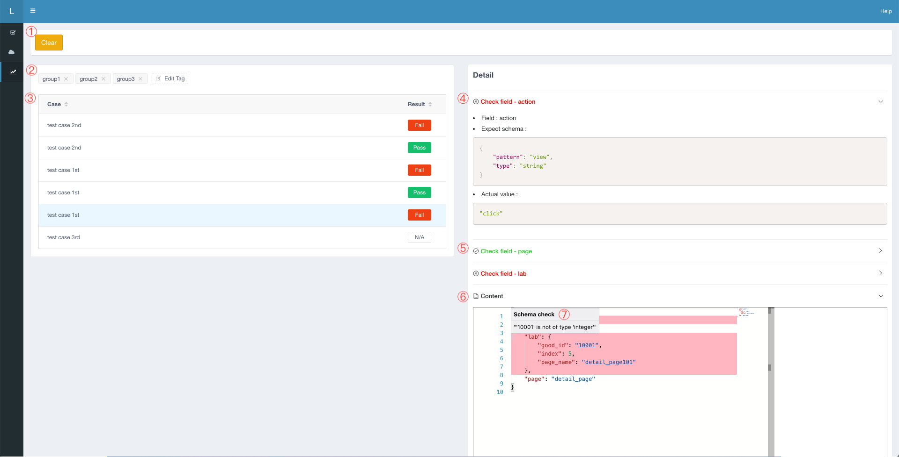

# Lyrebird-tracking

## 简介

***Tracking 是基于[Lyrebird](https://github.com/meituan/lyrebird)的插件，为移动端应用提供服务请求的数据分析及验证的功能***


## 环境要求

* macOS

* Python3.6及以上


## 安装

``` bash
pip3 install lyrebird-tracking
```

## 简单示例

请求数据分析的应用场景比较广泛，以其中一种典型应用场景如客户端[埋点](https://baike.baidu.com/item/%E5%9F%8B%E7%82%B9)的分析校验来进行示例

### 分析待测对象

1. 假设埋点上报的host为 ***abctest.com***
2. 埋点上报内容如下所述，key2字段为索引值，action与page字段是待校验项

``` json
[
    {
        "key1": "val1",
        "property1" : [
            {
                "key2": "val2",
                "action": "view",
                "page": "detail_page"
            }
        ]
    }
]
```

### 编写配置文件

1. selector:以JSONPath描述过滤筛选JSON的逻辑，详细语法示例见[附录](#配置文件数据格式)
2. assert：校验逻辑，校验action与page两个字段，以JSONSchema语法描述预期

``` json
{
    "target": [
        "abctest.com"
    ],
    "cases": [{
        "name": "test case 1st",
        "selector": "$[?key1='val1'].property1[?key2='val2']",
        "asserts": [{
                "field": "action",
                "schema": {
                    "type": "string",
                    "pattern": "view"
                }
            },
            {
                "field": "page",
                "schema": {
                    "type": "string",
                    "pattern": "detail_page"
                }
            }
        ]
    }]
}
```

### 校验功能

若移动端发出符合预期的Request Data，如下

``` json
[
    {
        "key1": "val1",
        "property1" : [
            {
                "action": "view",
                "key2": "val2",
                "lab": {
                    "good_id": 10001,
                    "index": 5,
                    "page_name": "detail_page101"
                },
                "page": "detail_page"
            }
        ]
    }
]
```

Tracking会自动分析和校验，如图所示



若移动端发出不符合预期的Request Data，如其中action字段的值不符合预期"view"，如下

``` json
[
    {
        "key1": "val1",
        "property1" : [
            {
                "action": "click",
                "key2": "val2",
                "lab": {
                    "good_id": 10001,
                    "index": 5,
                    "page_name": "detail_page101"
                },
                "page": "detail_page"
            }
        ]
    }
]
```

Tracking会自动分析和校验，并将错误信息高亮标红展示，如图所示




## 详细功能介绍


如上图所示：

1. 工具栏：清空测试缓存

2. 分组标签：可以分组筛选查看case的结果

3. case列表：以时间倒序排列展示的case记录

    1. case通过，即为所有校验字段全部通过，展示绿色 Pass Button
    2. case失败，即为只要有一个校验字段失败，展示红色 Fail Button
    3. case没有触发，展示为N/A状态，点击可以查看具体预期值等信息
    4. 单行点击，可以唤起对应的case详情，查看具体校验字段和原数据等信息

4. 校验字段详情展示：点击左侧一行，右侧会展示对应的校验详情，展开状态

    1. Field：校验字段
    2. Expect Schema：校验字段对应的预期JSONSchema
    3. Actual vaule：实际校验字段的值

5. 校验字段名和结果展示：校验详情的收起状态， 收起状态的校验结果有三种：

    1. 字段校验通过，校验字段展示绿色
    2. 字段校验失败，校验字段展示红色
    3. 字段校验逻辑为空，校验字段展示蓝色

6. 匹配数据展示区

    1. 展示匹配查询规则的数据
    2. 字段校验失败，红色高亮提示
    2. 未配置校验/断言逻辑的，蓝色高亮提示
    3. 校验结果错误展示红色高亮提示，鼠标悬停在字段上，会有详细的错误提示


## 使用流程

1. 准备基准数据文件，数据格式见[附录](#JSONPath-简明介绍)

2. 将基准数据文件放入指定路径下: ***~.lyrebird/plugins/lyrebird_tracking/base.json***

3. 启动[Lyrebird](https://github.com/meituan/lyrebird)工具，[手机链接代理](https://github.com/meituan/lyrebird#%E8%BF%9E%E6%8E%A5%E7%A7%BB%E5%8A%A8%E8%AE%BE%E5%A4%87)，操作过程中观测case校验等信息展示


## 开发者指南

``` shell
# clone 代码
git clone https://github.com/meituan/lyrebird-tracking.git

# 进入工程目录
cd lyrebird-tracking

# 创建虚拟环境
python3 -m venv venv

# 安装依赖
source venv/bin/activate
pip3 install -r requirements.txt

# 使用IDE打开工程（推荐Pycharm或vscode）

# 在IDE中执行debug.py即可开始调试
```


## 附录

### 配置文件数据格式

#### 字段说明

* target：待校验的host集合

* cases：测试用例集合

    * name：测试用例名

    * selector：JSONPath语法描述的查询条件

    * asserts：校验条件

        * field：需要校验的字段

        * schema：JSONSchema语法描述的校验条件，不校验可填为{}，前端会高亮显示该字段

* groupname（可选）：case对应分组的组名

* groupid（可选）：case对应分组的组id


``` json
{
    "target": [
        "abctest.com"
    ],
    "cases": [{
        "name": "test case 1st",
        "selector": "$[?key1='val1'].property1[?key2='val2']",
        "asserts": [{
                "field": "action",
                "schema": {
                    "type": "string",
                    "pattern": "view"
                }
            },
            {
                "field": "page",
                "schema": {
                    "type": "string",
                    "pattern": "detail_page"
                }
            }
        ],
        "groupname": "group1",
        "groupid": 1
    }, {
        "name": "test case 2nd",
        "selector": "$[*].property2[?key3='val3']",
        "asserts": [{
                "field": "action",
                "schema": {
                    "type": "string",
                    "pattern": "click"
                }
            },
            {
                "field": "page",
                "schema": {
                    "type": "string",
                    "pattern": "home_page"
                }
            }
        ],
        "groupname": "group2",
        "groupid": 2
    }]
}
```

### JSONPath 简明介绍

用于查询逻辑的selector配置基于[JSONPath](https://support.smartbear.com/alertsite/docs/monitors/api/endpoint/jsonpath.html)的语法。类似于XPath在xml文档中的定位，JSONPath表达式通常是用来路径检索或设置Json的。目前仅支持一部分JSONPath语法，如下所述。

#### 支持语法

<table>
<tr><td>JSONPath</td><td>描述</td></tr>
<tr><td>$</td><td>根对象。例如$name</td></tr>
<tr><td>[num]</td><td>数组访问，其中num是数字。例如$[0].leader.departments[1].name</td></tr>
<tr><td>[*]</td><td>数组访问，访问所有数组的元素。例如$[*].leader.departments[2].name</td></tr>
<tr><td>[key='test']</td><td>字符串类型对象属性判断相等的过滤，例如$departs[name = 'test']</td></tr>
<tr><td>.</td><td>属性访问，例如$name.a.b</td></tr>
</td>
</table>


#### 语法示例

``` json
[
  {
    "name":"king",
    "property":123,
    "house":120
  },
  {
    "name":"wang",
    "property":456,
    "house":240
  },
  {
    "name":"king",
    "car":"audi",
    "house":120
  },
  {
    "name":"king",
    "property":123,
    "house":789
  },
  {
    "name":"king",
    "property":666,
    "house":666
  }
]
```

<table>
<tr><td>JSONPath</td><td>语义</td></tr>
<tr><td>$</td><td>根对象</td></tr>
<tr><td>$[1]</td><td>第1个元素</td></tr>
<tr><td>$[*]</td><td>全部元素</td></tr>
<tr><td>$[name='king']</td><td>list中name属性为'king'的元素</td></tr>
<tr><td>$[name='king'].property</td><td>list中name属性为'king'的元素并且取该元素的property属性的值</td></tr>
</td>
</table>

### JSONSchema 介绍

用于校验逻辑的schema配置基于[JSONSchema](https://json-schema.org/understanding-json-schema/basics.html)的语法。JSON Schema 用以标注和验证JSON文档的元数据的文档，可以类比于XML Schema。相对于JSON Schema，一个JSON文档就是JSON Schema的一个instance，可以校验数据结构、数据类型、和详细的判断等。

